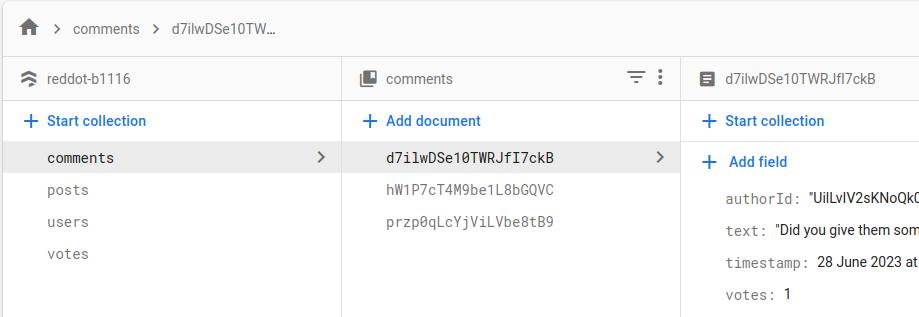

# Reddot

Live DEMO: [here](https://reddot-b1116.web.app/)

This project is made for educational purposes and **a lot of stuff could be made _a lot_ simpler**. I choose to do it in a more fine grained way to learn.

## Technologies and solutions

- React
- MobX (authentication and user store)
- Firebase (Authentication, Firestore, Cloud Storage, Hosting)

Below you can see how I structured my database.

## Key functionalities that work

- Sign in with Google
- Submit post of text type
- See recent posts
- Comment on posts

## What would I do differently

- use tests to minimize manual debugging and **_specifically_ regression tests**
- use a relational database instead of a non-relational (firestore) for simpler data managment
- for a small app I wouldn't complicate things this much as simpler methods would be sufficient
- use TypeScript as it is statically typed, though I resolved a chunk of debugging difficulties with PropTypes
- use Styled Components instead of JSS because of a bigger community and support
